# простой индекс

## Создаём таблицу

```sql
CREATE TABLE electronics_reviews (
    userId VARCHAR(255),
    productId VARCHAR(255),
    rating NUMERIC(2, 1),
    timestamp BIGINT
);
```

## Смотрим запрос без индекса

```sql
EXPLAIN ANALYZE
SELECT * FROM electronics_reviews WHERE userId = 'A6FIAB28IS79';
```

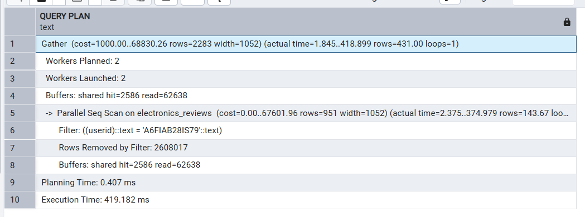

## Создаём индекс
```sql
CREATE INDEX idx_reviews_userid ON electronics_reviews (userId);
```


## Смотрим запрос с индексом

```sql
EXPLAIN ANALYZE
SELECT * FROM electronics_reviews WHERE userId = 'A6FIAB28IS79';
```

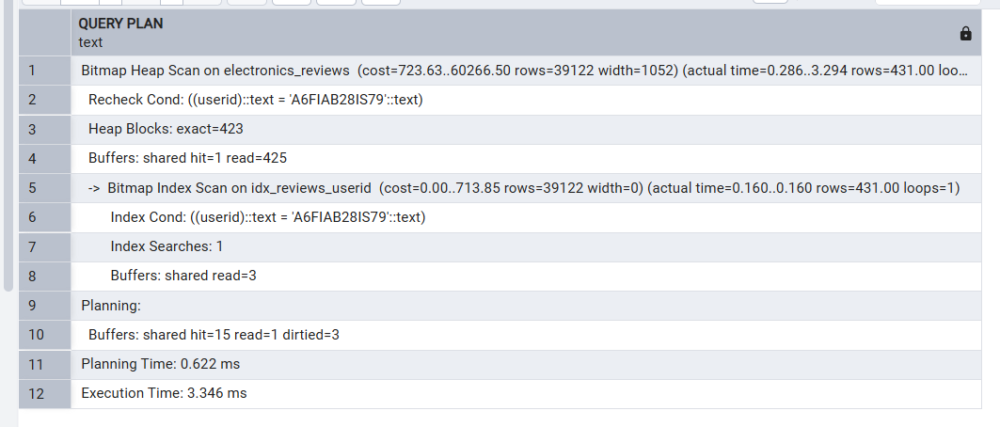


# многостолбцовый индекс

```sql
EXPLAIN ANALYZE
SELECT productId, rating, timestamp
FROM electronics_reviews
WHERE userId = 'A6FIAB28IS79'
ORDER BY timestamp DESC;
```

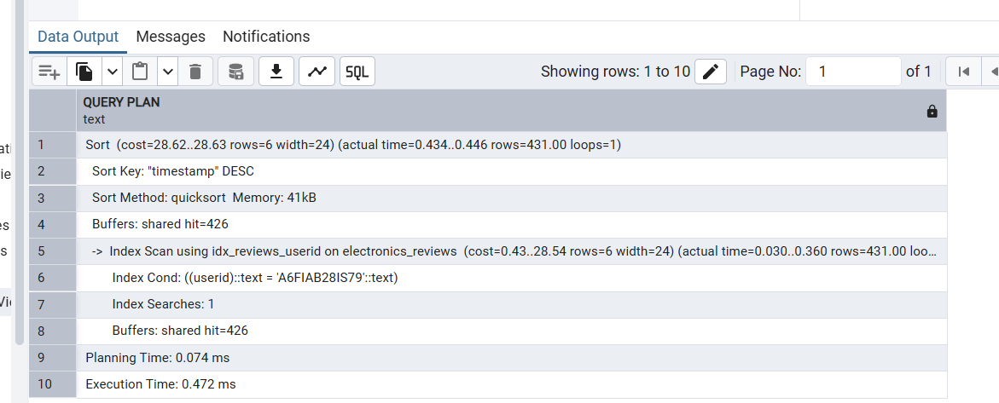

## создаём индекс

```sql
CREATE INDEX idx_reviews_userid_timestamp ON electronics_reviews (userId, timestamp);
```

## с индексом
```sql
EXPLAIN ANALYZE
SELECT productId, rating, timestamp
FROM electronics_reviews
WHERE userId = 'A6FIAB28IS79'
ORDER BY timestamp DESC;
```

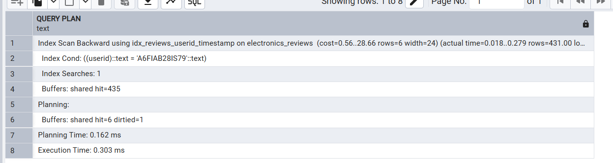

Немного быстрее

# Пробуем создать уникальный индекс

```sql
CREATE UNIQUE INDEX uq_reviews_userid_timestamp ON electronics_reviews (userId, timestamp);
```

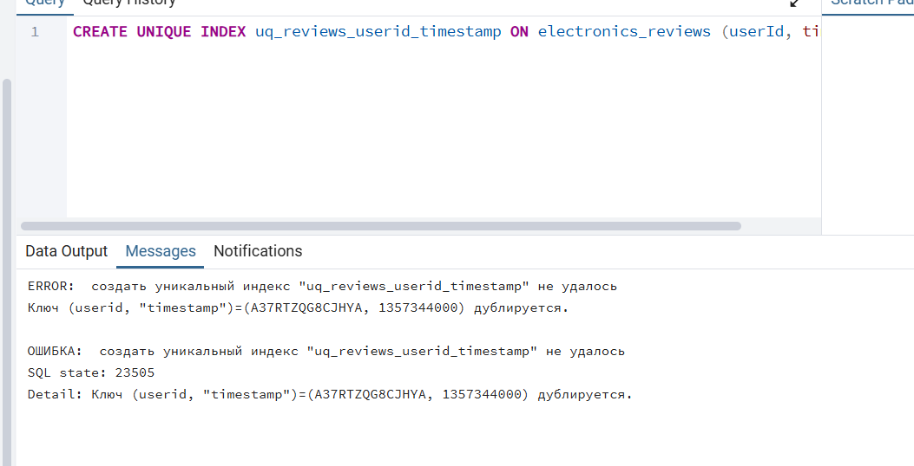

не получается, так как он накладывает некоторые ограничения

# Частичный индекс

```sql
EXPLAIN ANALYZE
SELECT userId, productId FROM electronics_reviews WHERE rating <= 2.0;
```
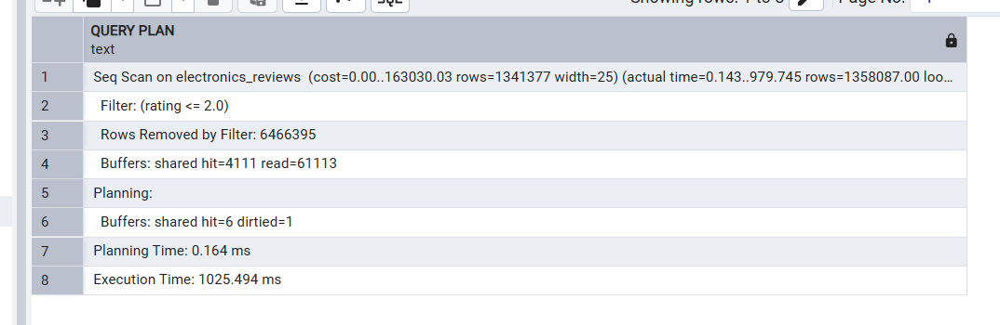

## создаем индекс

```sql
CREATE INDEX idx_reviews_low_rating ON electronics_reviews (rating) WHERE rating <= 2.0;
```

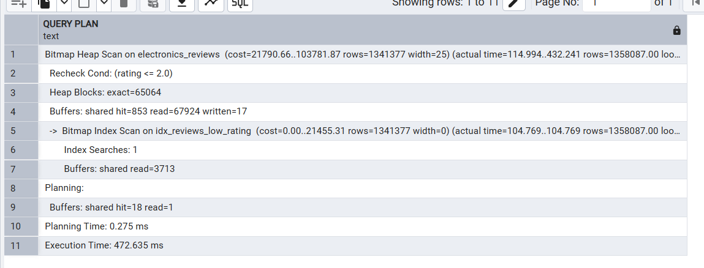


# неэфф индекс

из первого пункта

```sql
CREATE INDEX idx_reviews_userid ON electronics_reviews (userId);
```

## регистронезавимисый поиск

```sql
EXPLAIN ANALYZE
SELECT * FROM electronics_reviews WHERE LOWER(userId) = 'akm1mp6pooypr';
```

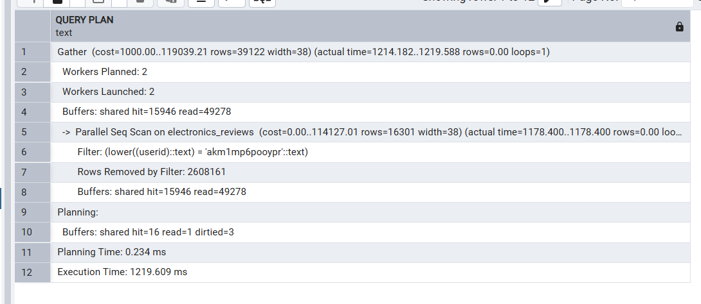


## решение: функциональный индекс

```sql
CREATE INDEX idx_reviews_userid_lower ON electronics_reviews (LOWER(userId));
```

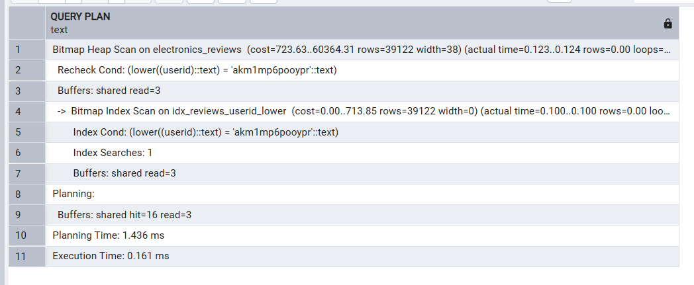

# неэффективность индекса при низкой селективности данных (много одинаковых значений)

```sql
CREATE INDEX idx_reviews_rating ON electronics_reviews (rating);
```

```sql
EXPLAIN ANALYZE
SELECT * FROM electronics_reviews WHERE rating = 5.0;
```

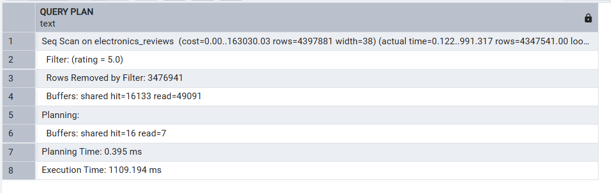

```sql
EXPLAIN ANALYZE
SELECT * FROM electronics_reviews WHERE rating = 1.0;
```

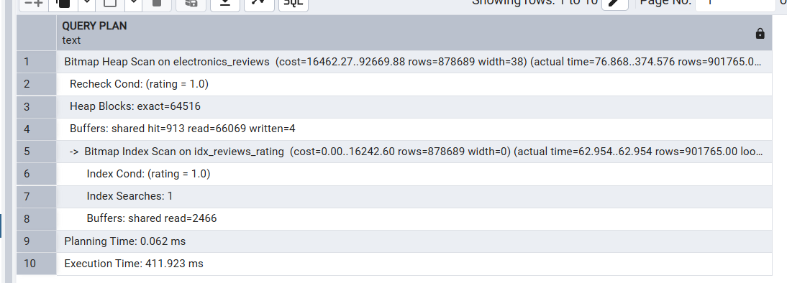

# Анализ пользователей с большим количеством низких оценок

```sql
EXPLAIN ANALYZE
SELECT
    userId,
    COUNT(*) AS review_count,
    AVG(rating) AS avg_rating
FROM electronics_reviews
GROUP BY userId
HAVING COUNT(*) > 100 AND AVG(rating) < 2.5
ORDER BY review_count DESC;
```

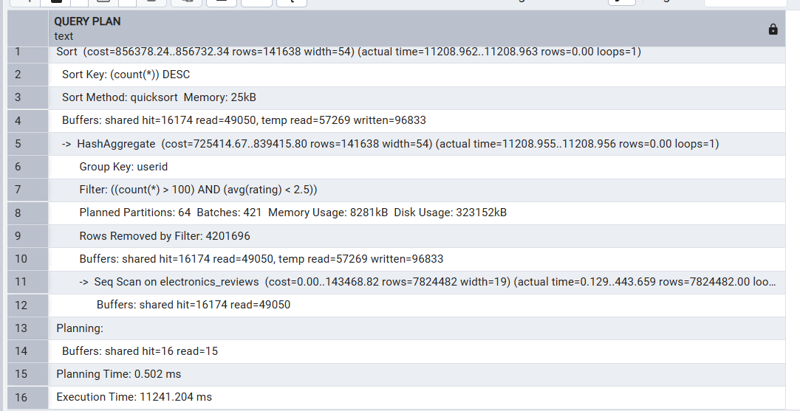

## создаем индекс

```sql
CREATE INDEX idx_reviews_userid_rating_covering ON electronics_reviews (userId, rating);
```

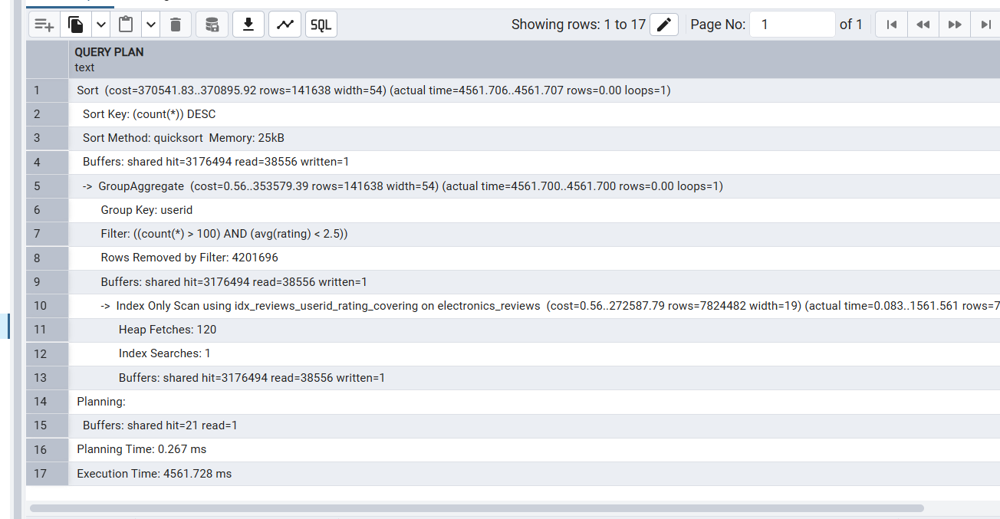

