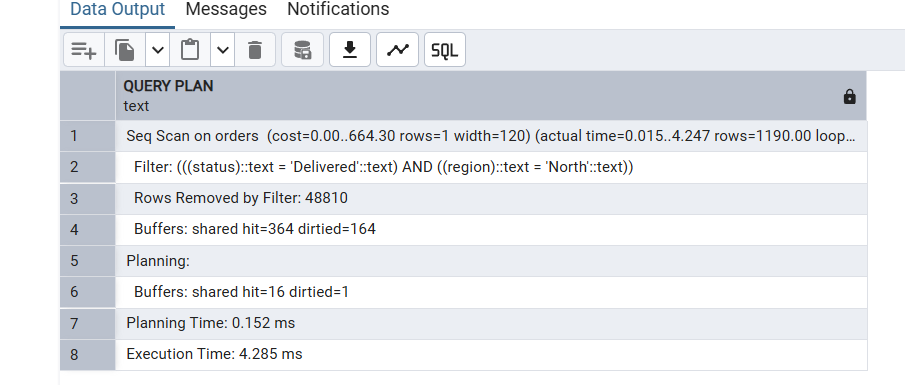
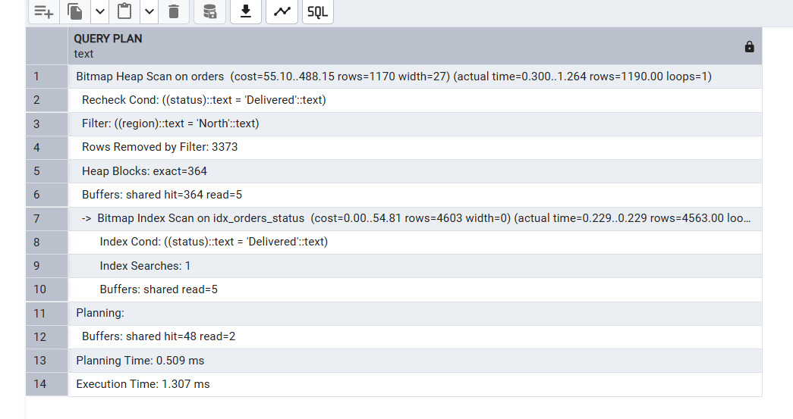
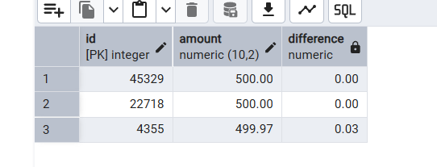
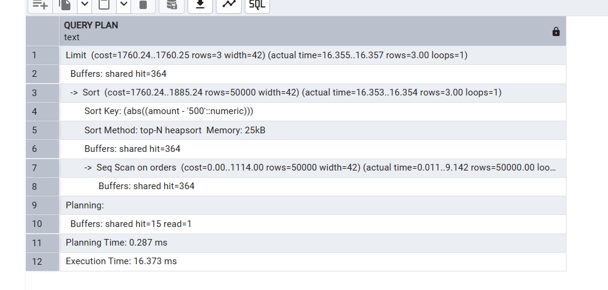
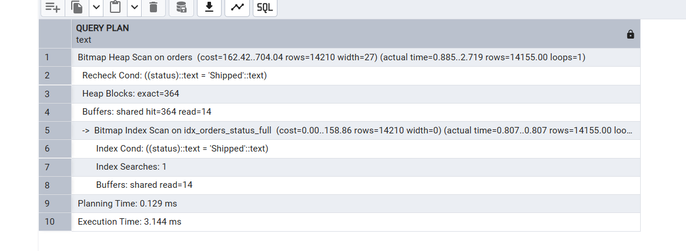
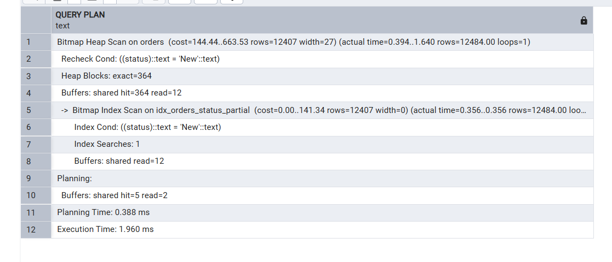
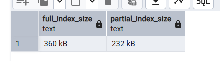

## создаем таблицу

```sql

DROP TABLE IF EXISTS orders;

CREATE TABLE orders (
    id SERIAL PRIMARY KEY,
    customer_id INTEGER,
    status VARCHAR(20),
    region VARCHAR(10),
    amount DECIMAL(10, 2)
);

INSERT INTO orders (customer_id, status, region, amount)
SELECT
    generate_series,
    CASE
        WHEN random() < 0.25 THEN 'New'
        WHEN random() < 0.50 THEN 'Processing'
        WHEN random() < 0.75 THEN 'Shipped'
        ELSE 'Delivered'
    END,
    CASE
        WHEN random() < 0.25 THEN 'North'
        WHEN random() < 0.50 THEN 'South'
        WHEN random() < 0.75 THEN 'East'
        ELSE 'West'
    END,
    (random() * 1000 + 50)
FROM generate_series(1, 50000);

```

# Поиск по нескольким условиям низкой кардинальности

## без индекса

```sql
EXPLAIN ANALYZE
SELECT * FROM orders
WHERE status = 'Delivered' AND region = 'North';
```



## создаем индекс

```sql
CREATE INDEX idx_orders_status ON orders(status);
CREATE INDEX idx_orders_region ON orders(region);
```



# Поиск по числовому признаку

## запрос

```sql
SELECT id, amount, abs(amount - 500) AS difference
FROM orders
ORDER BY difference
LIMIT 3;
```



## создаем индекс

```sql
CREATE INDEX idx_orders_amount ON orders(amount);
```



# Задание 3. Создание частичного индекса

## полный
```sql
CREATE INDEX idx_orders_status_full ON orders(status);
```

```sql
EXPLAIN ANALYZE
SELECT * FROM orders WHERE status = 'Shipped';
```




## частичный
```sql
CREATE INDEX idx_orders_status_partial ON orders(status)
WHERE status IN ('New', 'Processing');
```

```sql

EXPLAIN ANALYZE
SELECT * FROM orders WHERE status = 'New';
```




## сравнение



