## Создаём бд
```sql
CREATE DATABASE gutenberg_search;
```


## Создаём таблицу с search vector

```sql
CREATE TABLE IF NOT EXISTS books (
    id SERIAL PRIMARY KEY,
    gutenberg_id INTEGER UNIQUE,
    title TEXT NOT NULL,
    author TEXT,
    language_code VARCHAR(10),
    content TEXT,
    search_vector TSVECTOR GENERATED ALWAYS AS (
        setweight(to_tsvector('english', coalesce(title, '')), 'A') ||
        setweight(to_tsvector('english', coalesce(author, '')), 'B') ||
        setweight(to_tsvector('english', coalesce(content, '')), 'C')
    ) STORED
);
```


## Создаём GIN индекс

```sql
CREATE INDEX books_search_idx ON books USING GIN (search_vector);
```

## Загружаем книги в таблицу

```python
import psycopg2
import requests
import re
import time

DB_SETTINGS = {
    "dbname": "gutenberg_search",
    "user": "postgres",
    "password": "postgres",
    "host": "localhost",
    "port": "5432"
}

BOOK_IDS = [1342, 11, 84, 1661, 98, 76, 1952, 174]

START_MARKER_RE = re.compile(r"\*\*\*\s*START OF (THIS|THE) PROJECT GUTENBERG EBOOK.*\*\*\*", re.IGNORECASE)
END_MARKER_RE = re.compile(r"\*\*\*\s*END OF (THIS|THE) PROJECT GUTENBERG EBOOK.*\*\*\*", re.IGNORECASE)

TITLE_RE = re.compile(r"Title:\s*(?P<title>.+)", re.IGNORECASE)
AUTHOR_RE = re.compile(r"Author:\s*(?P<author>.+)", re.IGNORECASE)
LANG_RE = re.compile(r"Language:\s*(?P<lang>.+)", re.IGNORECASE)

def fetch_and_parse_book(gutenberg_id):
    url = f"https://www.gutenberg.org/files/{gutenberg_id}/{gutenberg_id}-0.txt"
    try:
        response = requests.get(url)
        response.raise_for_status()
        text = response.text
    except requests.exceptions.RequestException as e:
        print(f"Ошибка при скачивании книги ID {gutenberg_id}: {e}")
        return None

    title_match = TITLE_RE.search(text)
    author_match = AUTHOR_RE.search(text)
    lang_match = LANG_RE.search(text)

    title = title_match.group('title').strip() if title_match else "Unknown Title"
    author = author_match.group('author').strip() if author_match else "Unknown Author"
    language = lang_match.group('lang').strip().lower() if lang_match else "english"
    
    start_match = START_MARKER_RE.search(text)
    end_match = END_MARKER_RE.search(text)

    if start_match and end_match:
        content = text[start_match.end():end_match.start()].strip()
    else:
        content = text

    print(f"  > Найдена книга: '{title}' от '{author}'")
    
    return {
        "gutenberg_id": gutenberg_id,
        "title": title,
        "author": author,
        "language_code": language[:10],
        "content": content
    }

def main():
    conn = None
    try:
        print("Подключение к базе данных...")
        conn = psycopg2.connect(**DB_SETTINGS)
        cursor = conn.cursor()
        print("Подключение успешно.")

        for book_id in BOOK_IDS:
            print(f"\nОбработка книги с ID: {book_id}...")
            book_data = fetch_and_parse_book(book_id)
            
            if book_data:
                sql = """
                INSERT INTO books (gutenberg_id, title, author, language_code, content)
                VALUES (%(gutenberg_id)s, %(title)s, %(author)s, %(language_code)s, %(content)s)
                ON CONFLICT (gutenberg_id) DO NOTHING;
                """
                cursor.execute(sql, book_data)
                print(f"  > Книга ID {book_id} добавлена в базу данных.")
            
            time.sleep(1) 

        conn.commit()
        cursor.close()
        print("\nВсе книги успешно загружены.")

    except psycopg2.Error as e:
        print(f"Ошибка при работе с PostgreSQL: {e}")
    finally:
        if conn:
            conn.close()
            print("Соединение с базой данных закрыто.")

if __name__ == "__main__":
    main()
```


## Задание 1: Поиск фраз с расстоянием между словами

```sql
EXPLAIN ANALYZE
SELECT title, author
FROM books
WHERE content ~* '\y(artificial(\s+\w+){0,4}\s+intelligence|intelligence(\s+\w+){0,4}\s+artificial)\y';
```

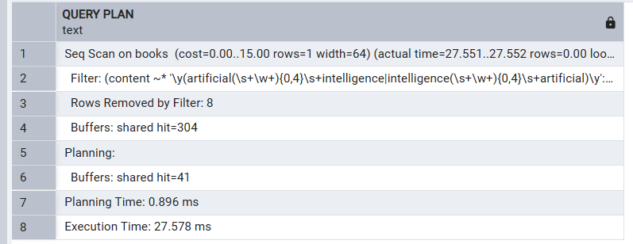


```sql
EXPLAIN ANALYZE
SELECT title, author
FROM books
WHERE search_vector @@ to_tsquery('english', 'artificial <5> intelligence');
```

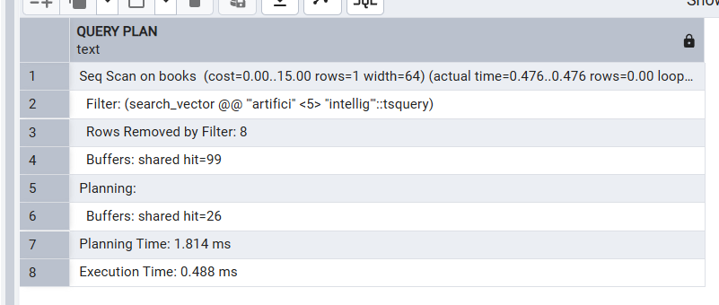

## Задание 2: Поиск с морфологией и синонимами

```sql
EXPLAIN ANALYZE
SELECT title, author
FROM books
WHERE 
    content ILIKE '%comput%' OR
    content ILIKE '%calculat%' OR
    content ILIKE '%algorithm%';
```

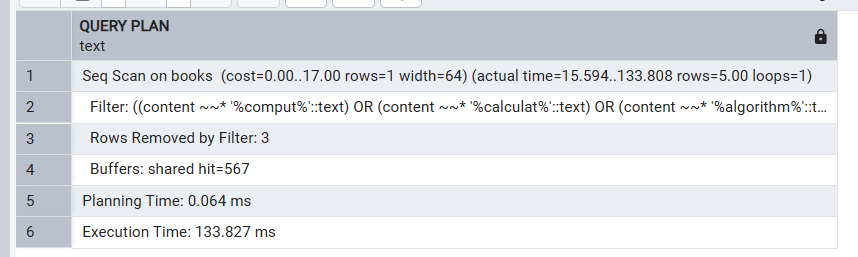

```sql
EXPLAIN ANALYZE
SELECT title, author
FROM books
WHERE search_vector @@ to_tsquery('english', 'compute | calculation | algorithm');
```

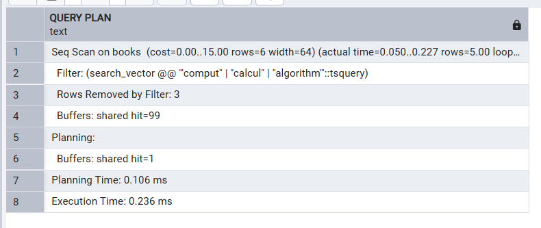

## Задание 3: Поиск с приоритетами по полям

```sql
EXPLAIN ANALYZE
SELECT title, author
FROM books
WHERE title ILIKE '%revolution%' OR author ILIKE '%revolution%' OR content ILIKE '%revolution%'
ORDER BY
    CASE WHEN title ILIKE '%revolution%' THEN 1
         WHEN author ILIKE '%revolution%' THEN 2
         WHEN content ILIKE '%revolution%' THEN 3
         ELSE 4
    END;

```

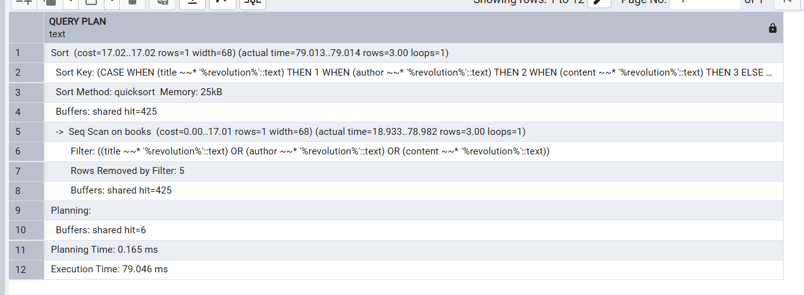

```sql
EXPLAIN ANALYZE
SELECT title, author, ts_rank(search_vector, to_tsquery('english', 'revolution')) as rank
FROM books
WHERE search_vector @@ to_tsquery('english', 'revolution')
ORDER BY rank DESC;

```


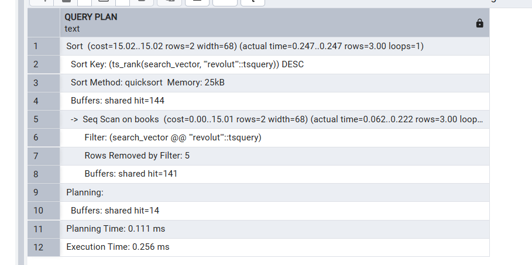

## Задание 4: Иерархический поиск с булевыми операторами

```sql
EXPLAIN ANALYZE
SELECT title
FROM books
WHERE (content ILIKE '%base%' OR content ILIKE '%network%')
  AND content NOT ILIKE '%machine learning%';
```

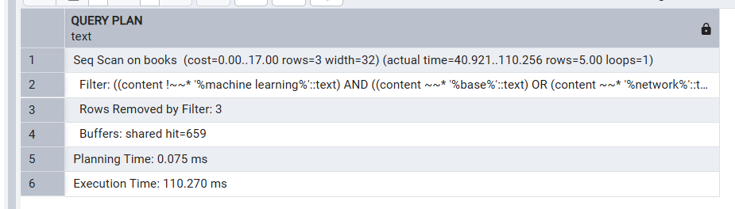

```sql
EXPLAIN ANALYZE
SELECT title
FROM books
WHERE search_vector @@ to_tsquery('english', '(base | network) & !machine & !learning');
```

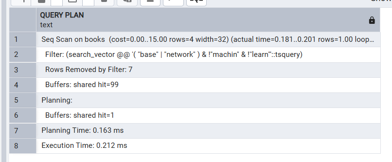

## Задание 5: Поиск с учетом лексического сходства (Thesaurus)

```sql
EXPLAIN ANALYZE
SELECT title
FROM books
WHERE content ILIKE '%philosophy%' 
   OR content ILIKE '%metaphysics%' 
   OR content ILIKE '%epistemology%'
   OR content ILIKE '%ethics%';
```

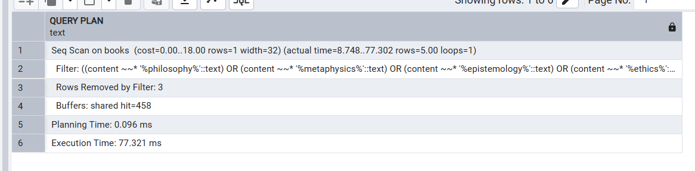


### Создаем словарь

my_thesaurus.ths

```
philosophy : metaphysics epistemology ethics
```

```sql
ALTER TABLE books ADD COLUMN search_vector TSVECTOR GENERATED ALWAYS AS (
    setweight(to_tsvector('english_with_thesaurus', coalesce(title, '')), 'A') ||
    setweight(to_tsvector('english_with_thesaurus', coalesce(author, '')), 'B') ||
    setweight(to_tsvector('english_with_thesaurus', coalesce(content, '')), 'C')
) STORED;

```

```sql
CREATE TEXT SEARCH DICTIONARY english_thesaurus (
    TEMPLATE = thesaurus,
    DictFile = my_thesaurus,
    Dictionary = english_stem
);

CREATE TEXT SEARCH CONFIGURATION english_with_thesaurus (COPY = english);

ALTER TEXT SEARCH CONFIGURATION english_with_thesaurus
ALTER MAPPING FOR asciiword, hword_asciipart, asciihword
WITH english_thesaurus, english_stem;
```

Выполняем запрос
```sql
EXPLAIN ANALYZE
SELECT title
FROM books
WHERE search_vector @@ to_tsquery('english_with_thesaurus', 'philosophy');
```

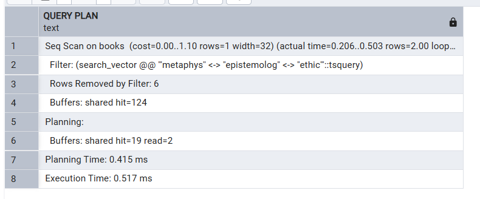

## Задание 6: Поиск с выделением контекста


```sql
EXPLAIN ANALYZE
WITH positions AS (
    SELECT id, title, strpos(lower(content), 'math') as pos
    FROM books
    WHERE content ILIKE '%math%'
)
SELECT 
    p.title,
    substring(b.content from p.pos - 50 for 100 + length('math')) as context
FROM positions p
JOIN books b ON p.id = b.id
WHERE p.pos > 50;
```

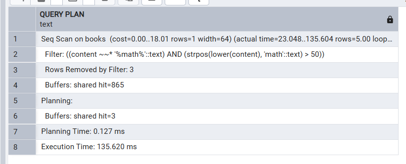


```sql
EXPLAIN ANALYZE
SELECT 
    title, 
    ts_headline('english', content, to_tsquery('english', 'math'), 
                'MinWords=5, MaxWords=15, MaxFragments=3, StartSel=<mark>, StopSel=</mark>') as context
FROM books
WHERE search_vector @@ to_tsquery('english', 'math');
```

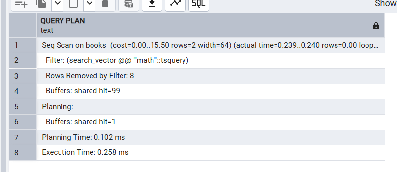

## Задание 7: Агрегационный поиск с группировкой

```sql
EXPLAIN ANALYZE
SELECT author, count(*) as book_count
FROM books
WHERE content ILIKE '%algorithm%'
GROUP BY author
ORDER BY book_count DESC
LIMIT 5;

```

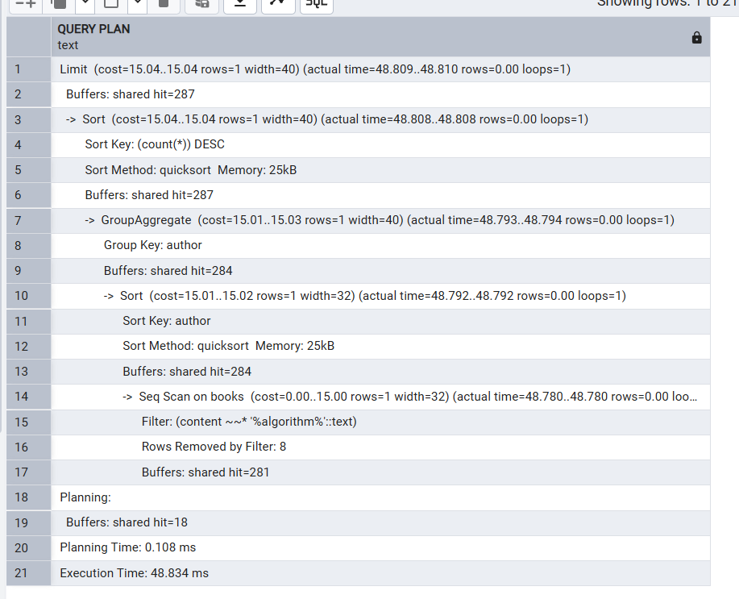

```sql
EXPLAIN ANALYZE
SELECT author, count(*) as book_count
FROM books
WHERE search_vector @@ to_tsquery('english', 'algorithm')
GROUP BY author
ORDER BY book_count DESC
LIMIT 5;
```

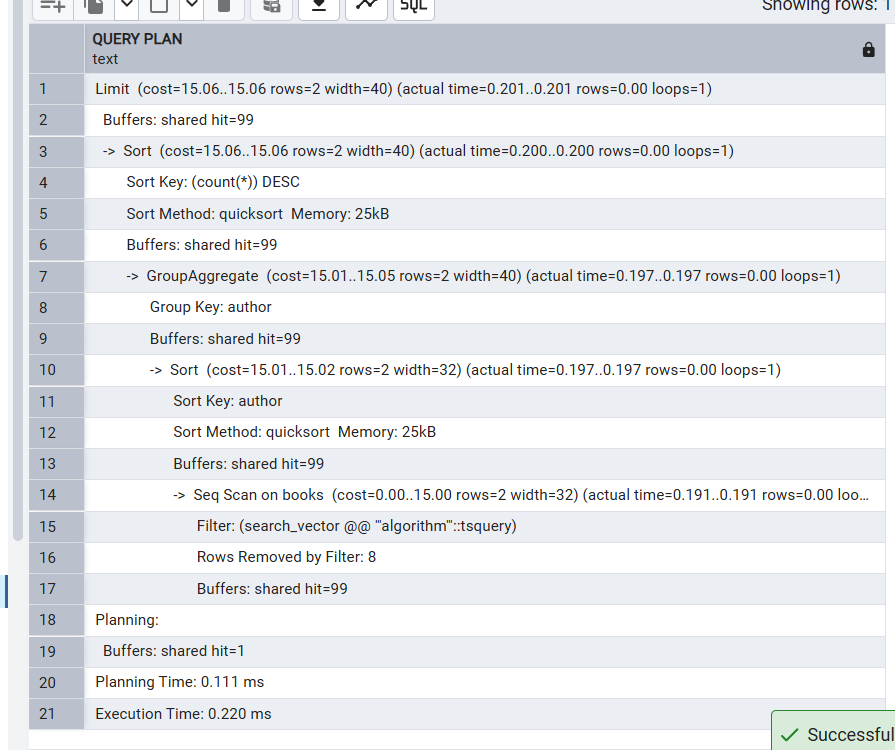

## Задание 8: Морфологические отличия (разные языки)

```sql
EXPLAIN ANALYZE
SELECT word, count(*)
FROM (
    SELECT unnest(regexp_matches(content, '(respect|arvonanto)', 'gi')) as word
    FROM books
) as matches
GROUP BY word;

```

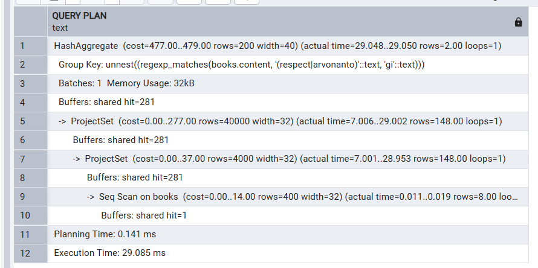

```sql
EXPLAIN ANALYZE
SELECT 'respect' as word, count(*)
FROM books
WHERE search_vector @@ to_tsquery('english', 'respect');
```

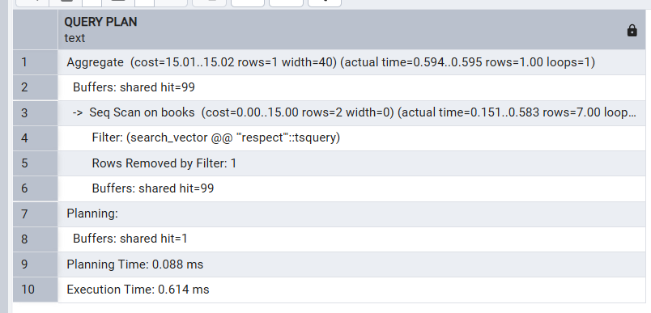