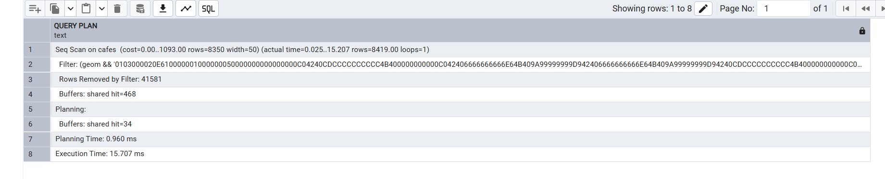
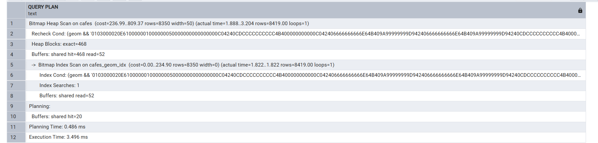
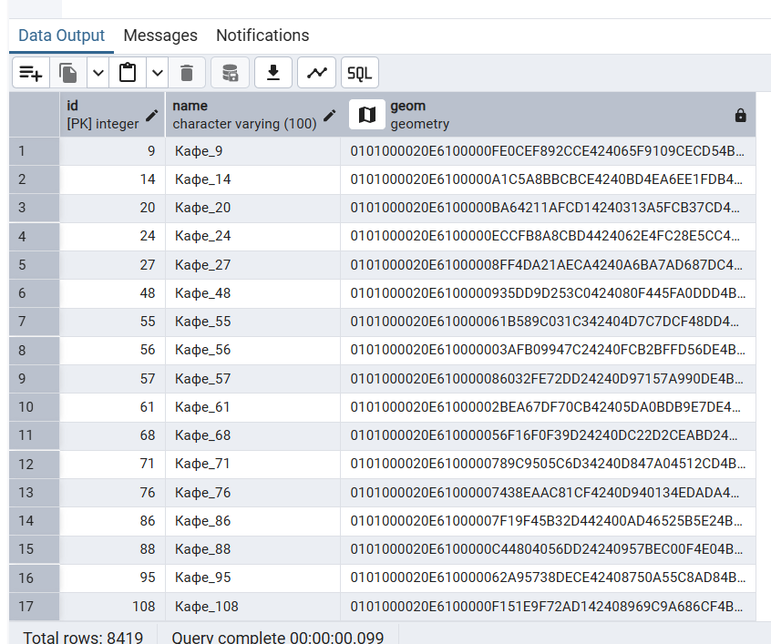
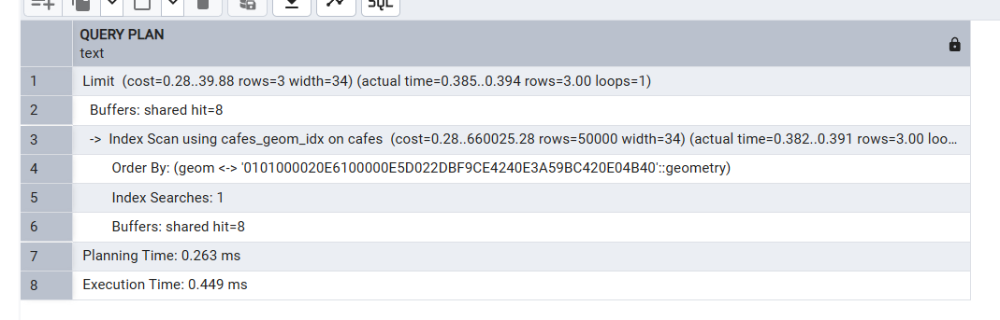
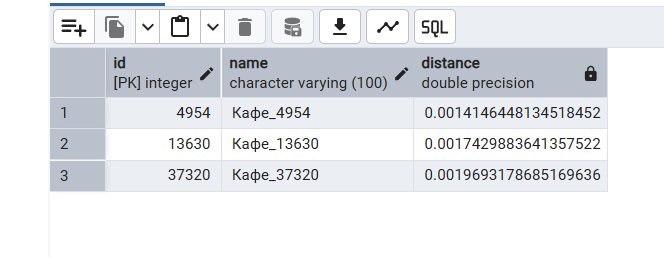
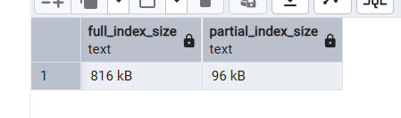
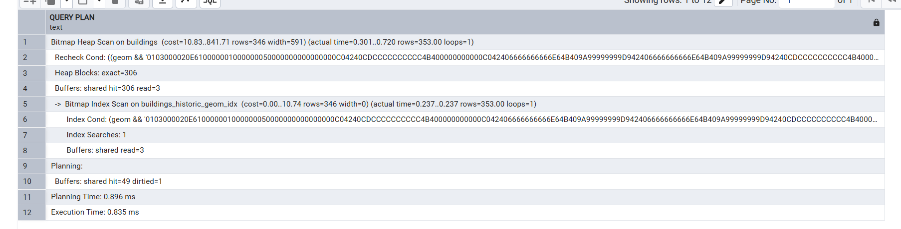

# Поиск объектов в области 

## Создаем таблицу

```sql

CREATE EXTENSION IF NOT EXISTS postgis;

CREATE TABLE cafes (
  id SERIAL PRIMARY KEY,
  name VARCHAR(100),
  geom GEOMETRY(Point, 4326)
);

INSERT INTO cafes (name, geom)
SELECT
  'Кафе_' || generate_series,
  ST_SetSRID(ST_MakePoint(
    37.3 + random() * 0.6,
    55.6 + random() * 0.4
  ), 4326)
FROM generate_series(1, 50000);

```

## Поиск без индекса

```sql
EXPLAIN ANALYZE
SELECT *
FROM cafes
WHERE geom && ST_MakeEnvelope(37.5, 55.6, 37.7, 55.8, 4326);
```



## Создаём индекс

```sql
CREATE INDEX cafes_geom_idx ON cafes USING GIST (geom);
```

## Поиск с индексом

```sql
EXPLAIN ANALYZE
SELECT *
FROM cafes
WHERE geom && ST_MakeEnvelope(37.5, 55.6, 37.7, 55.8, 4326);
```





# Поиск ближайших объектов 

```sql
EXPLAIN ANALYZE
SELECT
  id,
  name,
  ST_Distance(geom, ST_SetSRID(ST_MakePoint(37.617, 55.751), 4326)) as distance
FROM cafes
ORDER BY
  geom <-> ST_SetSRID(ST_MakePoint(37.617, 55.751), 4326)
LIMIT 3;
```





# Частичные индексы

```sql
CREATE TABLE buildings (
    id SERIAL PRIMARY KEY,
    name VARCHAR(100),
    is_historic BOOLEAN,
    geom GEOMETRY(Polygon, 4326)
);

INSERT INTO buildings (name, is_historic, geom)
SELECT
    'Здание_' || generate_series,
    (random() < 0.1),
    ST_SetSRID(ST_Buffer(
        ST_MakePoint(
            37.3 + random() * 0.6,
            55.6 + random() * 0.4
        ),
        0.0005 + random() * 0.001
    ), 4326)
FROM generate_series(1, 20000);
```

## полный индекс

```sql
CREATE INDEX buildings_geom_idx ON buildings USING GIST (geom);
```

## частичный
```sql
CREATE INDEX buildings_historic_geom_idx ON buildings USING GIST (geom)
WHERE is_historic = true;
```

## сравнение

```sql
SELECT
  pg_size_pretty(pg_relation_size('buildings_geom_idx')) AS full_index_size,
  pg_size_pretty(pg_relation_size('buildings_historic_geom_idx')) AS partial_index_size;
```




## Запрос на частичном индексе

```sql
EXPLAIN ANALYZE
SELECT *
FROM buildings
WHERE
  is_historic = true
  AND geom && ST_MakeEnvelope(37.5, 55.6, 37.7, 55.8, 4326);
```



